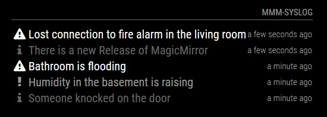

[](https://raw.githubusercontent.com/fewieden/MMM-syslog-slave/master/LICENSE) [](https://travis-ci.org/fewieden/MMM-syslog-slave) [](https://codeclimate.com/github/fewieden/MMM-syslog-slave) [](https://snyk.io/test/github/fewieden/mmm-syslog-slave) [](https://doclets.io/fewieden/MMM-syslog-slave/master)

# MMM-syslog-slave

MMM-syslog slave that gets the same notifications as the master, which can be filtered through a blacklist on smaller screens.

## Example



## Dependencies

* An installation of [MagicMirror<sup>2</sup>](https://github.com/MichMich/MagicMirror)
* A master installation of [MMM-syslog](https://github.com/paviro/MMM-syslog)

## Installation

1. Clone this repo into `~/MagicMirror/modules` directory.
1. Configure your `~/MagicMirror/config/config.js`:

    ```
    {
        module: 'MMM-syslog-slave',
        position: 'top_right',
        config: {
            ...
        }
    }
    ```

## Config Options

| **Option** | **Default** | **Description** |
| --- | --- | --- |
| `master` | `required` | Web address of your master in the format `http://ip:port`. |
| `max` | `5` | How many messages should be displayed on the screen. |
| `format` | `false` | Displays relative date format, for absolute date format provide a string like `'DD:MM HH:mm'` [All Options](http://momentjs.com/docs/#/displaying/format/). |
| `title` | `false` | Custom module header. |
| `title` | `false` | Custom module header. |
| `types` | `{INFO: "dimmed", WARNING: "normal", ERROR: "bright"}` | Object with message types and their css class. |
| `shortenMessage` | `false` | After how many characters the message should be cut. Default: show all. |
| `blacklist` | `[]` | List of types that should not be shown. `["INFO", "WARNING"]`|

## How to Use

Make an http get request like:
`http://MASTER_IP:MASTER_PORT/syslog?type=INFO&message=YOUR_MESSAGE`

## Developer

* `npm run lint` - Lints JS files.
* `npm run docs` - Generates documentation.

### Documentation

The documentation can be found [here](https://doclets.io/fewieden/MMM-syslog-slave/master)
